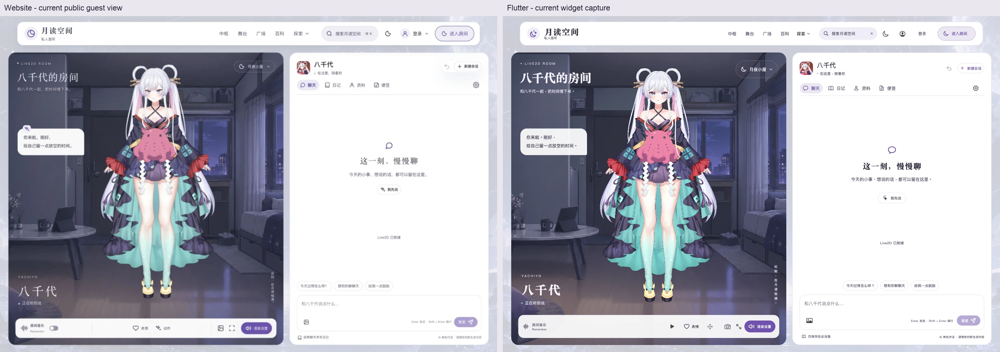
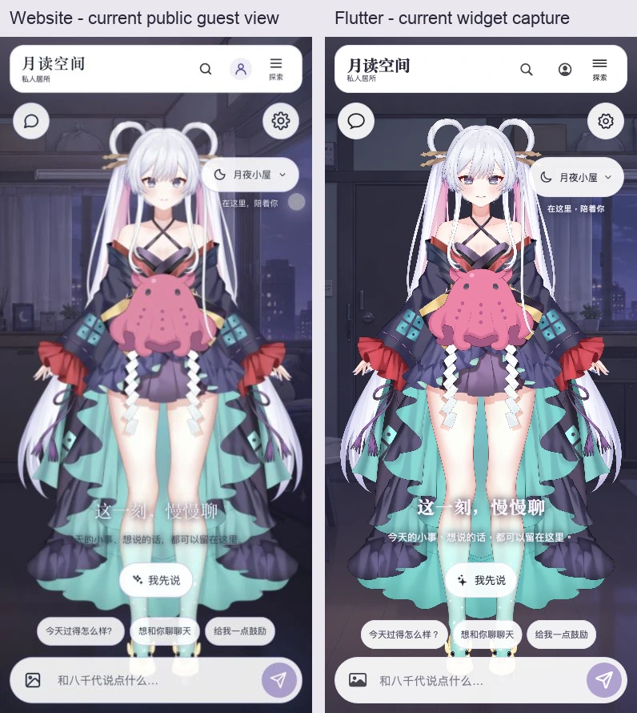
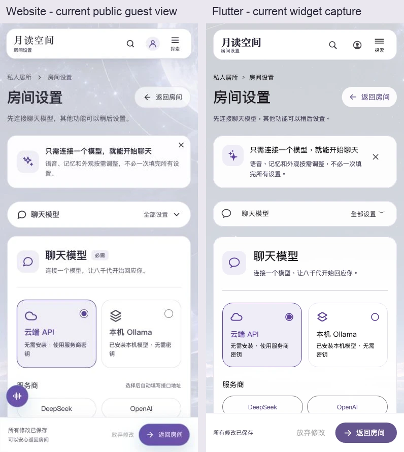
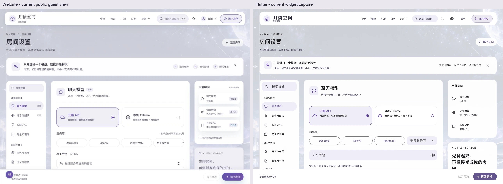

# Flutter 与原站完整一致性分析

日期：2026-09-30。目标：让原生 Flutter 版具备原站相同的入口、功能、数据语义、主要交互和视觉层级。

> 本文保留 `ed7c5a5` 修复前的分析快照，下面的“当前状态”和缺陷证据均指该基准。随后实施的修复、回归验证及剩余迁移范围见 [修复记录](parity-fixes-2026-09-30.md)，请勿将历史缺陷当成修复后状态。

## 结论

当前 0.4.0 已经建立可继续扩展的原生客户端基础：真实 Cubism 模型、Room 与设置、网站账号、可恢复的聊天同步、日记、记忆、文章、广场和成长接口均有实际实现。Room 的桌面双栏、手机场景叠层及设置页主要结构已接近原站。

但当前产品范围仍是“Room + 核心社区客户端”。距离“完整原站原生版”存在三类差距：

1. **整站覆盖不足**：Hub、Wiki、图库、像素工坊、游戏、投稿、完整个人中心和管理端等没有对应原生页面。
2. **已有页面的行为不完全一致**：本次复现了通知状态错误、中枢跳转替换、文章分享成长遗漏、长对话上下文失去问答配对；实时同步、角色行为、富文本和主题也存在代码级差异。
3. **验收范围不足以证明全站一致**：现有测试充分证明了部分核心能力，但没有覆盖全部原站路由、全部角色权限、所有内容格式、真机字体和音频效果。

建议保留现有网络、恢复、日记和原生模型基础，先建立统一路由和契约验收，再扩展页面。当前不需要整体重写，也不应仅通过增加几个页面截图就宣布整站完成。

## 1. 基准与证据

| 项目 | 本次基准 |
| --- | --- |
| Flutter | `ed7c5a524be0a668816ae585b93ef2e382e1f2a3`，`pubspec.yaml` 为 `0.4.0+4` |
| 原站本地源码 | `7c822e26abc2ada217a92cc9149f8161f4b7b5cb` |
| 原站远端 | 本次 `git ls-remote origin HEAD` 与本地 SHA 相同 |
| 原站公开界面 | `https://yachiyo.hk/room`、`/room/settings`，访客、浅色、无聊天历史 |
| Flutter 截图 | 本次重新运行现有 widget 截图测试，Room 加载真实 Cubism 模型；测试内存存储和测试服务，不使用生产账号 |
| 桌面视口 | Room：1417×960；设置：1280×900 |
| 手机视口 | 390×844 |

原站路由对应 26 个 Vue 页面文件，另有独立应用入口。以[固定提交的路由文件](https://github.com/redchenk/tsukuyomi-space/blob/7c822e26abc2ada217a92cc9149f8161f4b7b5cb/src/frontend/router/index.js)作为功能范围依据，而非只按 README 名称推断。

本次执行结果：

| 检查 | 结果 | 能证明什么 |
| --- | --- | --- |
| `flutter analyze` | 无问题 | 当前 Dart 静态分析通过 |
| `flutter test --dart-define=RUN_CUBISM_TESTS=true` | 129 通过、4 跳过 | 包括真实模型、渲染、协议、恢复和布局；跳过的是两项后端联调及两项可选截图测试 |
| 两项后端测试，开启 `RUN_WEBSITE_INTEGRATION` | 2 通过 | 使用原站真实 Express/SQLite 路由和临时数据，验证核心 API、图片、日记、分享撤销和账号恢复等 |
| Room/设置测试，开启 `CAPTURE_UI` | 35 通过 | 重新生成桌面与手机截图；该组包含原有设置测试，不能与 129 简单相加作为覆盖数量 |
| 本次诊断探针 | 4 通过 | 断言并确认四个**现存差异**；探针通过不代表这些差异已修复 |

原始截图、探针代码和日志保存在本机 `artifacts/parity-audit-2026-09-30/`，该目录按项目规则被 Git 忽略。下方四张对照图保存在 `docs/qa/parity-2026-09-30/`，可随分析文档一起保留。

本次没有重新构建五个平台安装包，没有测试付费 LLM/TTS，也没有登录生产账号。原站代码未修改；应用业务代码未修改。

## 2. 当前架构及可复用基础

原站主链路是 Vue 页面 → composables/services → 同一 Express API → SQLite/记忆及对象存储。Flutter 主链路是 widgets → `RoomController`/`RoomWorkspace`/`RoomArchive`/`SiteRepository` → `SiteClient` → 原站 API。

| 层 | 当前实现 | 判断 |
| --- | --- | --- |
| 应用入口和路由 | `main.dart` 使用 `MaterialApp`、`onGenerateRoute`；默认首页为 Room | 适合早期客户端，尚不是原站路由目录的完整映射 |
| Room 状态 | `RoomController`，聊天、取消、落盘、同步、账号隔离、录制 | 应保留，并逐步拆出纯上下文、同步事件和回复呈现逻辑 |
| 房间工作区 | `RoomWorkspace`、`RoomArchive`，资料/便签、环境、知识、记忆和日记 | 日记已有版本冲突、墓碑和同步恢复机制，不应退回简单覆盖保存 |
| 网站网络层 | `SiteClient` 限制同源 API、处理 Cookie、账号修订、超时与响应大小 | 已有迟到响应隔离和登录失效处理，适合扩展原站 API |
| 缓存 | `SiteRepository` 按 origin/account 保存快照，读请求去重，非幂等写入不盲重试 | 基础合理；继续扩展时需缓存版本、容量和失效规则 |
| 存储 | 安全存储保管密钥/Cookie；SharedPreferences 保存配置、历史和草稿 | 当前可用；若加入大图库、长内容和大量作品索引，再评估结构化本地数据库 |
| 模型与渲染 | C++ Cubism Core/Framework 物理 → FFI 网格 → Flutter Canvas | 是原生实现；不是官方 GPU renderer 的完整封装 |
| 默认配置来源 | `sync_room_reference.mjs` 生成 persona、预设、知识、音乐和行为参数数据 | 已减少数据手抄；行为算法和 CSS token 仍主要人工迁移 |

当前较大的文件为 `site_page.dart` 2140 行、`settings_page.dart` 1664 行、`room_page.dart` 1395 行。主要问题不是行数本身，而是多个功能同时共享路由分支、JSON 解包、加载状态和 UI。继续往这些文件直接增加全站功能，会使遗漏字段和不同页面行为更难发现。

## 3. 全站覆盖矩阵

“原生已有”指存在 Flutter 页面或操作实现；不等于所有细节已通过同站对照。

| 原站路由/模块 | Flutter 当前状态 | 要达到一致还需要什么 | 顺序 |
| --- | --- | --- | --- |
| `/`、`/access` 入口 | 启动直接进入 Room；没有原站入口页 | 明确原站入口、Hub 和 Room 的导航关系；实现入口页或经明确约定的原生启动入口 | 第二批 |
| `/hub` 中枢 | Room 的中枢入口被替换成 `/stage`；设置中的中枢打开浏览器 | 原生 Hub，保留聚合内容、统计、入口及动态；同一链接在各页行为一致 | 第一批 |
| `/login`、`/register` | 原生对话框支持密码、验证码、注册、重设密码 | QQ OAuth、回跳目标、邀请参数及完整账号绑定流程；继续补真实接口测试 | 第一/二批 |
| `/room` | 原生已有，主要聊天与房间功能已接入 | 即时跨设备事件、行为调度、口型和回复节奏、参考来源反馈、首次环境更新验收 | 第一批 |
| `/room/settings`、`/room-settings` | 八个设置分区原生已有 | 统一别名/查询参数路由、主题及共享导航；服务商真实配置验收 | 第一批 |
| `/room/shared/:shareId` | 支持创建/撤销分享；没有对应原生读取页面 | 读取分享、恢复场景、原生内容展示、应用内链接进入与公开内容边界 | 第二批 |
| `/live2d` 隐藏预览 | 原生设置中有调试能力，没有同名独立页面 | 先以参数/动作调试能力验收，再确定是否保留独立隐藏入口 | 后续 |
| `/stage` | 原生列表、分类、排序、搜索、分页已有 | 与全局导航统一；补各排序/筛选/空态的数据与视觉验收 | 第一批 |
| `/articles/:id/:slug?`、`/article` | 原生详情、评论、点赞、收藏、有效阅读已有 | `/article` 别名、slug/查询跳转、目录/阅读进度、完整富文本、分享与成长一致 | 第一/二批 |
| `/plaza` | 原生留言、回复、点赞、每页 8 条与统计已有 | 作者主页/通知/文章等链接联动，完整回复与审核状态验收 | 第二批 |
| `/growth` | 原生成长、签到、任务、邀请与记录已有 | 各任务目标应用内进入、分享入口统一上报、Room 成长反馈闭环 | 第一/二批 |
| `/user-center` | 用 `/user` 实现资料、文章、留言和收藏子集 | 原站路径映射、头像、作品管理、账号安全、邮箱和通知设置 | 第二批 |
| `/users/:username` | 没有原生个人公开主页 | 作者/上传者/回复者资料与作品入口 | 第二批 |
| `/notifications` | 原生列表、分页和单条标已读已有 | 修正字段、查看目标、全部已读、未读角标、通知偏好 | 第一批 |
| `/wiki`、角色和术语词条 | 从 Room 走原站浏览器入口 | 原生目录、检索、角色/词条、图片、来源、交叉链接；复用原站数据文件并生成 Flutter 数据 | 第三批 |
| `/gallery`、`/gallery/manage` | 没有原生页面 | 图片浏览、上传、上传者、个人管理、审核状态、保存和分享 | 第三批 |
| `/attachments` | 没有原生附件库 | 上传、筛选、复制资源地址、受控文件访问、删除和审核 | 第三批 |
| `/editor` | 主舞台“投稿”打开浏览器 | 原生编辑/预览/草稿、封面和附件、分类、提交与审核回读 | 第三批 |
| `/pixel`、`/arena/*` 重定向 | 没有原生像素工坊 | 固定 192×108 画布、触控绘制、作品发布、点赞、PNG 导出；保留兼容链接 | 第四批 |
| `/game` | 没有原生游戏 | 保留节奏、键盘/触控、全屏、暂停和成绩接口；原生游戏循环验收 | 第四批 |
| `/friend-links`、`/friend-links/apply` | 广场侧栏打开浏览器 | 目录、申请、校验、审核/监测状态 | 第三批 |
| `/reality` | 没有原生说明页 | 项目、联系方式、隐私及素材来源信息 | 第二批 |
| `/admin`、`/terminal` | 没有原生管理界面 | 按原站角色逐功能实现审核与管理；普通账号不得显示或进入管理员操作 | 第五批 |
| `/agent-os` 独立应用 | 没有原生运行时 | 单独定义原生能力对应范围；现有网站入口不能算作原生迁移完成 | 单独评估 |

浏览器回退可作为迁移期间入口，但系统浏览器与应用安全存储中的登录会话互不共享，所以“能打开网页”并不意味着用户可以无缝完成原生工作流。

## 4. 已确认缺陷与重要行为差异

优先级含义：P1 是影响目标页面或核心行为的差距；P2 是局部功能、反馈或视觉差距。本次未发现需要以“阻止启动/全部功能不可用”描述的 P0。

### P1-01：中枢被替换为主舞台，导航入口语义不统一

证据：[room_page.dart:172](/Users/yxy/Desktop/codex/tsukuyomi-space-app/lib/features/room/room_page.dart:172)。本次 widget 探针点击桌面“中枢”，实际进入的 `SitePage.path` 为 `/stage`。

设置页 `_go` 则把 `/hub` 打开到浏览器；`SitePage` 未认识的路由默认加载并显示文章列表。三条路径对同一目标产生不同结果。

另一个同类问题：Room 顶部“进入房间”传入 `/room`，该路径不在 `_website` 的原生白名单中，会走浏览器打开；原站自身该按钮仍指向同一房间。

**修复方式**：建立一个共享路由目录，所有导航、搜索、通知、任务和内容链接使用同一解析函数；未知站内路由显示明确回退/未实现页，不能默认展示文章。实现原生 Hub 并保留原站路径。

### P1-02：已读通知仍显示未读圆点

证据：[site_page.dart:1987](/Users/yxy/Desktop/codex/tsukuyomi-space-app/lib/features/site/site_page.dart:1987) 对照原站 `notification-repository.js:4–9`。原站通知是 `unread: !read_at`，没有客户端使用的 `is_read`。

本次探针提供 `unread: false` 且有 `read_at` 的通知，仍找到 `CupertinoIcons.circle_fill`。标记已读后重新读取也不会正确去掉圆点。

**修复方式**：建立 Notification 数据模型，显式解析 `unread/read_at/link`；补标记已读后圆点消失、未读数更新、查看目标、全部已读和翻页用例。

### P1-03：长历史回复会挤掉对应的用户问题

证据：[llm_client.dart:89](/Users/yxy/Desktop/codex/tsukuyomi-space-app/lib/core/llm_client.dart:89)。原生从最后一条消息开始取尾部字符，直到 6000 字耗尽；没有保持问答配对或每条消息限额。

复现输入为一轮“34 字用户问题 + 7000 字助手回复”。原生模型请求中历史只剩 6000 字助手内容，用户问题消失；第一条非 system 消息变成 assistant。调用原站 `selectRecentRoomConversation` 的同一输入则保留用户问题和约 2480 字助手摘要。

**修复方式**：将原站纯函数的消息预算、首尾摘要、问答配对规则迁移为 Dart；用完全相同 JSON fixtures 比较输出。尤其区分真正的助手主动开场与缺失用户问题的孤立回答。

### P2-01：文章复制链接遗漏分享成长动作

证据：[site_page.dart:1402](/Users/yxy/Desktop/codex/tsukuyomi-space-app/lib/features/site/site_page.dart:1402)。原生文章复制只写剪贴板并提示成功；原站 `SocialShareActions.vue` 的 `copyLink` 还调用分享成长上报。

本次探针点击文章“复制链接”，请求记录中没有 `POST /api/growth/actions/share`。原生邀请链接已包含上报，文章入口没有，因此同一类用户行为在两个端的任务结果不一致。

**修复方式**：统一文章/作品/对话/邀请分享服务，成功复制或完成系统分享后调用同一成长接口；每日奖励仍由服务器去重。

### P1-04：跨设备更新采用轮询，缺少原站事件语义

证据：[room_controller.dart:109](/Users/yxy/Desktop/codex/tsukuyomi-space-app/lib/features/room/room_controller.dart:109) 每 30 秒调用聊天和日记同步；原站 `roomMemorySync.js:82` 订阅 `/api/room/memory/events`，分别处理 chat/memory 事件。

原生可以在轮询后反映服务端聊天修改，已有恢复测试支持这一点；但“可同步”不能替代“实时更新”。记忆列表和站内未读信息也没有统一事件失效机制。

**修复方式**：在现有同步机制上增加一个账号范围的事件订阅器；切账号/过期/后台时关闭，恢复时重连；按事件失效聊天/记忆查询，不覆盖正在编辑的草稿。现有轮询可保留为断线兜底。

### P1-05：角色行为是语义子集，不能视为完整原站行为调度

证据：[room_animation.dart:44](/Users/yxy/Desktop/codex/tsukuyomi-space-app/lib/live2d/room_animation.dart:44)。聊天回复按少量中文关键词选择 `tears/bsmile/smile/neutral` 和简化动作。原站 `live2dBehaviorController.js` 与 orchestrator 还处理动作语义、侧向、强度、延时、优先级、打断及语音对齐。

默认表情/动作数据已同步，但原生在部分参数应用中直接设置 value，没有复用原站的 weight 和完整调度语义。队列能够执行，不代表同一回复产生同样的动作计划。

原生模型 loader 读取 Moc、Physics、Textures、Expressions，没有读取 manifest 的 Motions。原站当前主要行为也包含参数驱动，因而不能把“缺少任意 motion3 播放”直接等同为当前每个按钮都坏了；应先用原站实际动作计划做一致性基准。

**修复方式**：先统一行为意图输出，再实现 scheduler 和参数执行规则；对固定文本/动作计划验收时序和参数轨迹。只有性能或模型兼容验收不能满足要求时，才评估原生纹理与官方 GPU renderer。

### P2-02：MP3 等音频的口型采用合成波形

证据：[voice_service.dart:134](/Users/yxy/Desktop/codex/tsukuyomi-space-app/lib/core/voice_service.dart:134)。原生支持可解析 WAV 的 RMS 包络；其他格式或无法解析的 WAV 使用正弦式口型。MiniMax 等提供商返回 MP3 时会进入此分支。

原站 `live2dSpeech.js` 优先对解码后音频做 Web Audio RMS 分析，也有分析失败的合成回退。差异在于原生对 MP3 常规路径就回退，不能以“能播放且嘴在动”证明语音一致。

**修复方式**：对解码后的 PCM 做统一包络，或在当前播放器支持的路径提供真实音量采样；分别验证停顿、句尾归零、seek/停止、播放状态和表情时序。

### P1-06：上下文预算与来源组织没有完整迁移

原站 `roomContext.mjs` 在统一 8000 字预算内，按来源和每条记录限额打包，并返回 trace。原生 `RoomWorkspace.context` 会先把整个来源 JSON 截断，账号记忆再在 `LlmClient.memoryContext` 单独加入，最多额外 8000 字。

结果是同一问题可以得到不同的知识/记忆比例、更大的最终参考块和不同的截断点；原生也未呈现原站“实际参考记忆条数”的同等反馈。

**修复方式**：迁移 pack/score/excerpt/select 的纯函数规则，返回结构化 trace；统一最终提示词预算。LLM 随机输出不适合逐字验收，发出的 system、conversation、图片和工具上下文应先做到确定性一致。

### P1-07：文章正文的格式能力和链接行为仍有差距

原站 `shared/markdown.cjs` 支持脚注、提示容器、折叠、画廊、媒体指令、公式、代码高亮等。原生 `ArticleBody` 使用通用 Markdown/HTML 组件，未建立这些自定义语法和样式的对应实现；HTML 路径会移除 iframe。文章内点击链接统一打开系统浏览器。

这会影响技术文章、视频、站内交叉引用和 Wiki 阅读，不能只用普通文字文章作为“阅读功能一致”的验收样本。

**修复方式**：建立原站内容样本集合，逐一实现原生 block renderer；媒体用原生播放/外部打开的明确行为，站内链接交给共享路由。补目录、锚点、图片查看和阅读进度。

### P2-03：主题和语言状态不一致

证据：[main.dart:43](/Users/yxy/Desktop/codex/tsukuyomi-space-app/lib/main.dart:43) 每次从浅色开始，主题只有 widget 状态；原站 App.vue 持久保存主题，缺省为 dark，并支持中文/日语及海外英语。

原生没有同等 localization 资源/代理与语言入口；深色颜色也不同。例如原站 editorial surface 是 `#1b1e2c`，Flutter 为 `#25212f`，背景分别是 `#10121c`、`#17151e`。

**修复方式**：从实际 CSS 层叠后的语义 token 建立共享数据，持久化主题与语言；不要仅复制基础 tokens.css，因为 editorial.css 会覆写主要页面的颜色。

## 5. 本次截图审查

顺序为：①桌面 Room → ②手机 Room → ③手机进入设置 → ④桌面设置。每张图左侧为本次原站截图，右侧为本次 Flutter widget 截图。

### ① 桌面 Room，1417×960

- 优点：顶部导航、主内容边距、舞台/聊天两列、标签、快捷话题和输入区层级接近。
- 差距：原站音乐区使用靠近曲名的开关，原生播放按钮位于靠近表情区；图标、按钮边线和部分文字字重不同。空聊天区的欢迎内容和状态文字有垂直偏移。
- 可访问性风险：状态和快捷键辅助文字较小；需验证系统大字体后重排和真实对比度，截图不能证明屏幕阅读器可正确播报流式内容。

### ② 手机 Room，390×844

- 优点：全屏场景、顶部悬浮导航、工具按钮、角色和底部输入区主要结构接近；角色为真实原生模型。
- 差距：角色/背景裁切、环境气泡和欢迎文字位置有细微区别；图标和字体仍能辨别出两个实现。
- 可访问性风险：欢迎文案叠在有纹理背景上，原站与原生都应按不同场景核验文字可读性；键盘和大字体需真机验证。
- 限制：角色动画没有冻结到完全相同帧，不能把衣服姿态、眨眼或模型锐度差异直接判为 renderer 错误。

### ③ 手机设置，390×844

- 优点：返回房间、配置提示、分区选择、云端/本机卡片和底部保存状态结构已对齐。
- 差距：原生提示卡、分隔线、必需标签、单选图标、服务商按钮边线/颜色及底栏信息层级不同；原站的全站音乐入口未迁移。
- 可访问性风险：底部固定区需要验证键盘打开、系统大字体和最窄尺寸下的内容可达性；现有无溢出测试不等于所有控件可操作。

### ④ 桌面设置，1280×900

- 优点：左分区/中设置/右摘要三栏已实现，主要内容排序相近。
- 差距：两端中栏宽度及内边距不同，原站输入框为白色带边线，原生 API Key 输入使用淡紫填充；原站右侧摘要有独立状态卡和标签，原生更偏文本列表。
- 修正顺序：先统一共享组件、卡片/输入/单选/状态标签，再调整页面内部间距，避免逐页积累新的样式常量。

截图中的字体来自 macOS 测试字体装载，Songti 字体集合的字重选择可能影响标题；不能据此认定所有设备上的标题都过粗。Flutter 图片也不是 Android/iOS 设备截图。本次视觉结论仅覆盖这四个视图，未重新截图验收其余页面、深色主题或错误状态。

## 6. 推荐实施结构

### 统一原站路由和共享外壳

建立 `AppRoute`/`SiteLinkResolver` 一处定义 path、别名、参数、原生页面、需要的登录/角色以及临时外部入口。保留 `/user-center`、`/room/settings`、文章和分享的原站 URL 语义。Room、设置和社区页面共享同一个导航数据源与 AppShell；布局可以按页面需求不同，目标入口必须一致。

为 Android App Links、iOS Universal Links 和桌面链接接入预留同一 resolver。当前 Android 只有启动 intent-filter，iOS 没有对应 URL/associated domain 配置；现有应用分享 URL 不能直接证明冷启动能进入原生详情。

### 拆分功能页面和明确 API 数据模型

优先从 SitePage 分离 Stage、Article、Plaza、Growth、UserCenter、Notifications，按各页面持有 repository/state。沿用当前 ChangeNotifier 和已经可靠的网络实现，不必为拆分引入新的全局状态库。

Notification、Article、MessageThread、Growth、Share 等数据明确解析网站字段。不要在所有 widget 内自行猜测 `data` 是 List 还是 Map；允许兼容历史响应时，兼容规则也应在模型层完成。

### 保留恢复机制，增加契约与事件能力

稳定 turnId、先落盘后上传、账号/origin 隔离、迟到 Cookie 防护、日记 tombstone 和 metadata revision 均是现有正确基础。新页面沿用这些约束，并把实时事件、缓存失效和应用恢复状态接入同一生命周期。

SharedPreferences 目前保存内容快照和图片草稿。随着附件、作品和长历史增多，应监控容量/保存耗时，增加缓存清理；届时再迁移结构化存储，避免同时重写数据恢复层和全部页面。

### 建立可跟随原站变化的基准

- 记录生成默认数据所用的原站 SHA；CI 检查默认数据是否过期。
- `sync_room_reference.mjs` 目前依赖源码字符串切片和 VM 执行，原站常量位置变化会影响生成；逐步改为稳定数据模块导出。
- 建立共用 JSON fixtures，覆盖通知字段、问答预算、记忆打包、回复切分、行为计划、日记归并和消息线程。
- 原站同一 fixture 产生 JS 预期结果，Flutter 使用相同输入验证 Dart 输出；复杂跨语言算法无需靠人工肉眼追赶。
- 视觉基准固定 origin、数据、viewport、theme、语言、字体、时间、天气、模型状态。普通 golden 适合稳定布局；模型动画另外验收参数轨迹和 native raster。

## 7. 实施批次及退出条件

| 批次 | 工作内容 | 完成判据 |
| --- | --- | --- |
| 第一批：一致性基础与现存缺陷 | 四个复现问题、统一 resolver/AppShell、原生 Hub、通知完整闭环、上下文契约、事件订阅、主题保存 | 中枢确实进入 Hub；已读状态/未读数正确；文章分享任务一致；长历史保持配对；跨设备事件可见且保留草稿 |
| 第二批：核心用户闭环 | 完整 UserCenter/公开主页、QQ OAuth、邀请与回跳、公开对话读取、富文本/文章分享、全局导航与说明页 | 用户能在原生内完成登录→浏览→互动→成长→通知→回看内容，主要站内链接不意外离开应用 |
| 第三批：内容与创作 | Wiki、图库、附件、编辑器、友链及申请 | 能原生阅读词条、查看/上传/管理作品、编辑草稿并提交，审核状态和原站一致 |
| 第四批：特色互动 | 192×108 Pixel、游戏、完整角色行为与口型 | 绘制/发布/导出和游戏控制/成绩链路成立；固定行为场景时序可比，真实音频口型可信 |
| 第五批：完整角色范围及发布验收 | 管理端/终端、跨平台设备与长时性能、链接冷启动与签名安装 | 各原站角色的功能矩阵完成；五平台独立设备记录，不能用构建成功代替操作验收 |

如果每批需要排期，应先按固定范围完成一次小模块迁移测量，之后再估算；本次不提供缺乏实际工时依据的“几天即可全站一致”承诺。

## 8. 最终验收清单

1. **入口**：原站每个页面/别名/内容链接在应用中都有正确目的地；未实现项明确记录，不默认为主舞台。
2. **功能**：访客、用户、管理员、超级管理员分别覆盖读取、编辑、发布、审核和不可操作状态。
3. **数据**：同账号内容由同一 API 决定；通知、成长、日记、聊天和审核字段完全匹配；离线/到期/切账号后恢复正确。
4. **Room 行为**：同一配置发出的上下文一致，停止/重试/改写、记忆引用和行为计划可验证；LLM 文字本身允许服务端随机性。
5. **视觉**：同状态下至少覆盖 320、390、860、861、1280、1440 宽度，浅色/深色、中文/日语/英语、加载/空/失败/登录状态；截图在对应真机补验。
6. **内容**：普通文字、长文、表格、代码、公式、脚注、提示容器、图片、画廊、视频和站内锚点都有样本。
7. **平台**：Android/iOS 真机的键盘、安全区、局域网模型服务、系统分享、文件选择、字体、音频、定位和后台恢复；Windows/macOS/Linux 的窗口缩放、快捷键和长时运行。
8. **性能**：模型更新耗时、Flutter UI/raster 帧时间、内存、音频延迟和功耗分别记录；不能把 `updateMilliseconds` 当作整页帧率。

现有 `design-qa.md` 的“上述范围内没有未处理 P0/P1/P2”是旧验收范围结论，不是完整站点的证明。本报告采用更大的全站目标，并记录当前可复现的遗漏。后续状态应按每批退出条件更新，避免已实现、已联调、已截图和已真机验收混用。
