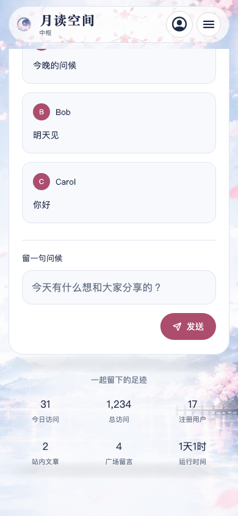
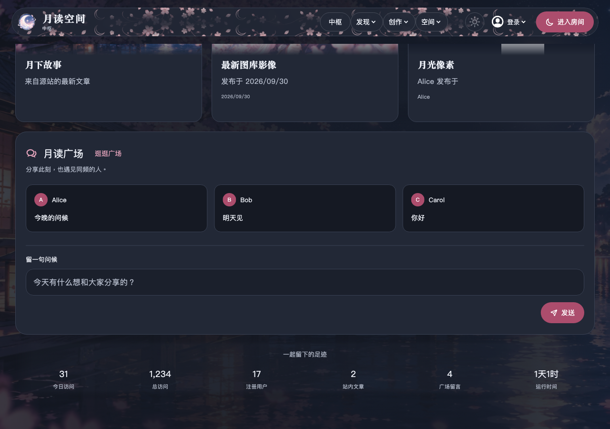

# 0.6.10 网站更新同步

对照来源：`tsukuyomi-space@836e11b56610cf83550fe7d51a4f830f95f05df5`，相对上一版的来源 `4b0ade76ac38dd0c0df551862b8b943a9cf96a15`。网站工作区的 README、设计资源、指南及输出目录保持原样。

| 更新 | 原生实现与验证 |
|---|---|
| 四季导航纹饰 | 使用网站四张 WebP 原图，固定尺寸重复纹饰；一层有界玻璃背景，按钮增加独立底色及边框，发现/空间菜单补齐图标 |
| 季节和深浅主题过渡 | 650ms 色彩插值；系统减少动画设置下关闭过渡，高对比度下取消导航纹饰和透明背景 |
| Hub 卡片和玻璃边缘 | 图片及像素画按横/纵方向渐隐；内容区和足迹区仅羽化背景，文本保持清晰。滚动内容不添加大面积 BackdropFilter |
| 足迹字体 | 标题 14→13px；数字 22→桌面18/手机16px，常规无衬线及等宽数字，标签11px；千位分隔和三语言运行时长 |
| 公告 | Hub 及首次访问弹窗使用原生 Markdown；保留内站链接、禁用活动协议/带凭据链接，图片只显示替代文字 |
| 模型参数 | 服务商默认与单模型覆盖；五类参数白名单、协议字段映射，四类能力覆盖。Room、结构化 Agent、原生 Agent 共用配置 |
| 模型目录 | 按当前服务商读取官方只读目录，保留原模型 ID；支持分页、文本模型过滤和显式能力声明。自定义地址不会自动接收目录密钥；支持手动刷新 |
| 目录边界 | 原生请求不跟随重定向，2MiB/页、最多8页/2000模型、15秒总预算；缓存只在内存、按端点和密钥加盐隔离。用户明确开启网站代理时才转交密钥 |
| 角色资料 | 同步最新电影字幕/小说条目及基础人设；按问题检索、剧透自愿、追问只继承上次用户问题；仅逐字未改的旧默认升级，保留自定义、禁用、删除及空库 |
| 长期记忆 | 每轮默认12条、可选1–30条，多条记忆公平共享3000字；保留重生成时的归属、版本和删除校验 |
| GitHub | 接入原站 OAuth；邮箱验证码必需，已有邮箱不重设密码；绑定/解绑沿用站点权限。授权 Cookie 只在临时容器，站点 `/me` 验证后才导入会话 |
| 文章与返回导航 | 保留原生编辑/预览、中文组合输入、正文先呈现、评论独立加载及锚点跳转。原生导航栈保留已有页面，不照搬 Vue 缓存实现 |

网站 Access 视频、SEO、CDN、部署与邮件后台变动不需要原生移植；应用继续启动即 Room、无开屏动画。

## 验证方式

`tool/sync_model_runtime_fixtures.mjs` 直接运行对应网站 JS 实现，产生独立的参数、目录和知识检索预期；`tool/sync_room_context_fixtures.mjs` 产生来源预算和轮次预期。新回归覆盖白名单、能力继承、拒绝重定向、无效地址不发送密钥、目录响应上限、自定义知识保留、无剧透检索、30条记忆共享预算、GitHub 原生邮箱流程及公告链接。

Hub 截图使用系统中文字体，覆盖360/390/768/1280/1920宽度与深浅主题，保存至本机 `artifacts/site-v0610/`；线上对照截图含公开实时内容，原生截图使用固定测试数据。完整回归另外覆盖三种语言、放大字体、菜单键盘、账户隔离和后台角色。

本机基础回归711项通过；启用真实网站后端夹具和 Cubism 后728项通过，剩余17项为运行时/截图门控。最终受影响控制和四协议传输回归104项通过；发布/运行时工具40项通过。

最终发布提交 `ad04d37e32345fa77cdf37b18e08918f7cf534d5` 的 CI：基础回归716项通过、34项门控跳过；真实网站后端与 Cubism 回归733项通过、17项门控跳过。五平台发布构建、四平台调试构建全部通过，Android 日志确认 `TSUKUYOMI_LIVE2D_OK`；三桌面的独立运行时与安装包内回归各110项通过、无跳过。

[v0.6.10-beta.1](https://github.com/redchenk/tsukuyomi-space-app/releases/tag/v0.6.10-beta.1) 的11个附件已全部下载，SHA-256 与 GitHub 元数据和发布清单一致。进一步校验 Windows/Linux 与 macOS 两种架构的固定运行时、逐文件校验值和许可证；macOS 主程序同时含 arm64/x86_64，iOS 为未签名 iPhoneOS 包，版本均为 `0.6.10+16`。[完整发布验证记录](qa/site-v0.6.10/release-validation.json)。

足迹区原生截图（固定测试数据）：

## 验收边界

本次没有使用用户模型密钥、第三方登录或付费账号验收。GitHub/QQ 的系统授权容器支持 Android、iOS、macOS、Windows；Linux 提供密码/邮箱登录，OAuth 明确提示容器不可用。目录自动防抖刷新、模型四项专项诊断及报告导出尚未移植，当前提供手动目录刷新和既有连接测试。

截图与组件稳定性回归不能证明所有真机的 GPU 帧率。本次没有宣称 2000 消息 + Live2D 的设备 P95 达标；角色渲染路径保持已有实现。iOS 安装包需要自签，macOS 未公证，Windows 未签名；缺少系统沙箱时命令执行继续拒绝。
