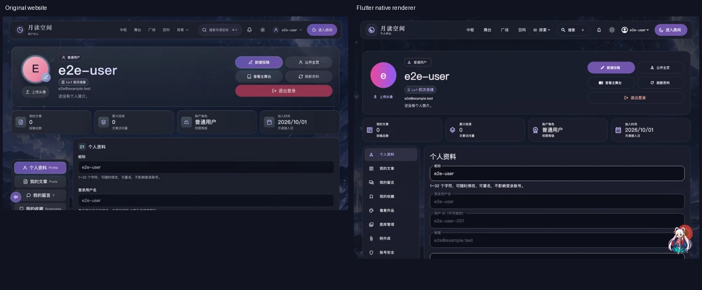
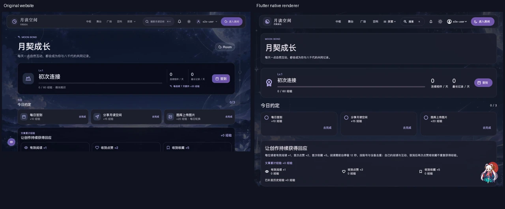
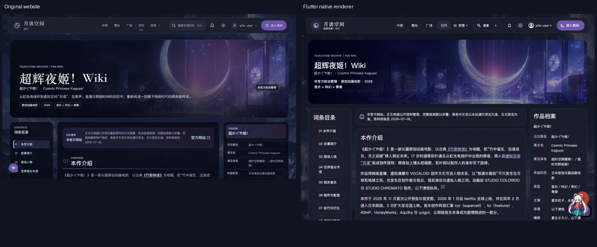
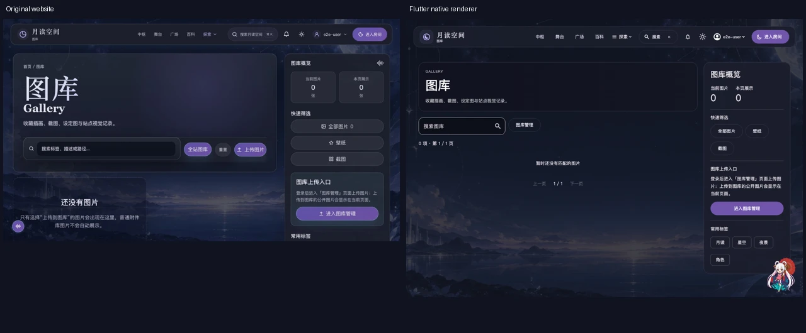
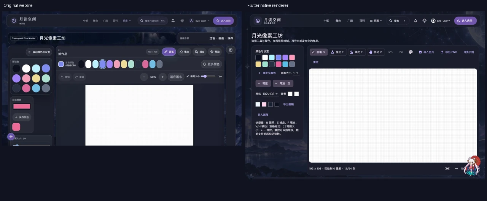
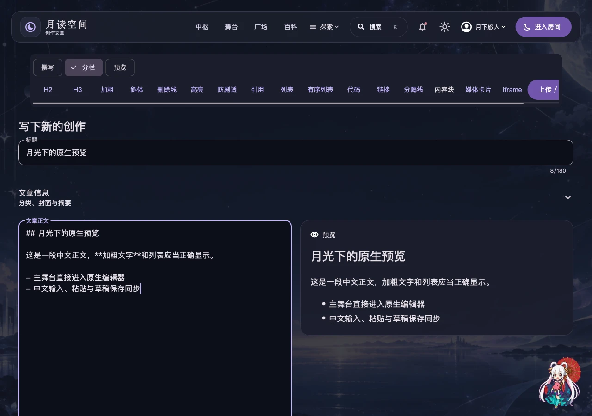
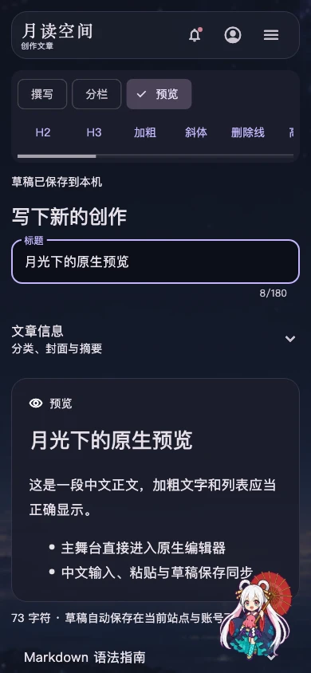

# 0.6.4：整站 UI 核对与原生入口修复

日期：2026-10-01。版本：`0.6.4+10 / v0.6.4-beta.1`。

本轮修复主舞台新建文章误开系统浏览器、个人中心把等级对象显示成一段代码的问题，并按当前原站重新检查原生页面。功能与响应式布局检查通过；以下截图和边界说明是视觉结论的依据，不能把“不溢出”理解为逐像素一致。

## 参照与证据

- 原站源码：[5c4346e](https://github.com/redchenk/tsukuyomi-space/tree/5c4346e20f5dbb9710707096f1cb73ea4c64b691)，Vue 页面、路由、CSS、三语文案及 Express/SQLite API。
- 生产站主舞台与游戏使用 Codex 浏览器读取；私有页面使用同一源码的隔离测试站 `127.0.0.1:4184`，账户与内容均为一次性测试数据。没有登录用户的生产账号。
- 浏览器参照图为当前页面截图；原生矩阵使用真实 Flutter 页面、经过脱敏的原站 API 快照。头像、图库的有内容状态另以严格测试后端和已解码图片检查。macOS 原生窗口另确认了舞台→编辑器、个人中心等级入口和百科图片/三栏布局。
- 原始 PNG 保存在忽略目录 `artifacts/ui-parity-2026-10-01`；[图片来源、尺寸与 SHA-256](qa/ui-v0.6.4/capture-manifest.json)。文档 WebP 保留完整画面，未裁掉失败区或重新绘制。对照图左侧网页、右侧原生；两侧高度不同，不能用于像素差分。

## 已修复的问题

1. **P1 · 主舞台投稿打开浏览器。** 新建文章、广场友链、成长任务统一使用原生路由；任务里的查询参数、百科锚点继续保留。回归直接检查最终页面类型，避免仅检查按钮是否存在。
2. **P1 · 个人中心等级显示 JSON。** 解析原站 `level.level`，兼容旧 `summary.level`，显示 1–9 级徽章；点击进入成长页。昵称、头像、角色、简介、四项统计及八组个人中心入口按原站重新排列。
3. **P2 · 成长页结构和经验语义不一致。** 改为紧凑等级/进度/连续相伴/签到概览、桌面每日任务三列、文章经验、邀请与历史双列和成长路径。阅读/点赞/收藏的单位奖励为 +1/+2/+5，累计经验独立显示，避免把累计为零误写成“奖励 +0”。成长页三语文案从原站源文件生成。
4. **P2 · 百科目录把正文推到首屏之外。** 桌面改成目录、正文、作品档案三栏；窄屏目录折叠。完整词条、搜索、剧透折叠、图片变体与锚点保留。首图使用原站已打包图片，实际 macOS 窗口已确认加载。
5. **P2 · 图库缺少概览与发现入口。** 补齐图片统计、全部/壁纸/截图筛选、常用标签和原生上传管理入口；宽屏侧栏、窄屏纵排。最新图片/随机轮播、上传、预览和管理继续使用真实接口，未添加伪造数据。
6. **P2 · 公共页面缺少网页内容结构。** 文章详情补上摘要、封面及原站日期/作者回退；公开主页恢复头像与身份并列、创作概览；友链、现实连接、站内信和附件统一页头层级。像素画桌面调色板移到画布左侧，窄屏仍纵排。
7. **P2 · 导航与大字号溢出。** 共享固定导航、原站品牌/页面副标题、紫色选中状态、搜索/通知/主题/账号/Room 入口；探索保留分组、键盘、Esc 和焦点恢复。文章排序、留言作者、成长操作、分页和设置保存栏按宽度与字号换行。
8. **P1 · 中文/平台粘贴未同步编辑模型。** 文本控制器直接监听正文与元信息变化，忽略仅选区变化；保留输入法 composing 范围，避免重写正在组合的文字。预览、模型和本机草稿使用同一内容，已有 180ms 合并刷新保留。

## 逐页核对表

每个下列路由都在 360、390、768、1280、1920 宽度，中文/日语/英语，深色/浅色下检查，共 **28×5×3×2=840 场景**。英语额外采用 2 倍字号。每页检查错误、共享导航、API 契约遗漏，并滚动后再次检查布局。该矩阵使用真实接口形状，遇到未知接口会失败；不是默认返回成功的占位服务。

| 原生页面 | 本轮核对重点 | 与网页端的关系 |
| --- | --- | --- |
| `/room` | 默认进入、顶部导航、模型就地配置 | 原生聊天/Live2D；首次配置与桌面 Agent 是已批准的原生设计 |
| `/room/settings` | 三栏/单列、所有分区、大字号、底部保存 | 复用原站模型与记忆逻辑，增加原生设备状态 |
| `/live2d` | 导演工作台窄屏/宽屏布局 | 原生渲染器与场景控件 |
| `/hub` | 共享导航、场景卡片、公告/广场 | 原生大厅，相同站点数据 |
| `/stage` | 投稿原生跳转、筛选/排序/作者等级 | 相同文章 API 与入口 |
| `/plaza` | 作者/时间换行、侧栏友链跳转 | 相同留言、点赞、回复和统计 |
| `/growth` | 规范等级对象、任务卡片、经验、邀请 | 相同奖励/领取 API；三语源文案同步 |
| `/user` | 等级徽章、身份概览、统计、八组入口 | 原生个人中心，相同资料与权限 |
| `/users/e2e-user` | 公开资料、等级、关注、创作概览 | 相同公开用户 API |
| `/conversations` | 会话/记忆列表及滚动 | 原生会话管理，相同私有接口 |
| `/notifications` | 页头/操作、未读状态、目标跳转 | 相同站内信接口 |
| `/wiki` | 首图、三栏正文、目录/搜索、锚点 | 当前原站静态资料与打包素材 |
| `/wiki/characters/yachiyo` | 完整角色词条、图片与变体 | 原站词条归档 |
| `/wiki/terms/tsukuyomi` | 独立术语、交叉链接 | 原站词条归档 |
| `/gallery` | 图片概览、快速过滤、上传入口 | 相同公开图库 API |
| `/gallery/manage` | 管理范围、原生上传/删除/预览 | 相同账户/管理员权限 |
| `/pixel` | 桌面左调色板、触控/快捷键、作品列表 | 原生画布，相同作品发布 API |
| `/friend-links` | 页头、空状态、目录 | 相同友链数据与监测字段 |
| `/friend-links/apply` | 申请、校验、恢复与状态 | 相同申请/审核逻辑 |
| `/reality` | 页头、段落、联系/支持/隐私锚点 | 当前原站三语正文与来源 |
| `/editor` | 三模式、中文/选区/粘贴、素材/发布 | 原生紧凑编辑器，相同草稿/文章逻辑 |
| `/attachments` | 页头、类型、存储、分页、恢复上传 | 相同附件接口及审核权限 |
| `/admin` | 小屏/大字号、审核员保护、文章管理 | 服务端确认 admin/super_admin 才开放 |
| `/terminal` | 管理入口、数据分区与操作布局 | 服务端确认管理员；普通用户禁止进入 |
| `/game` | 原生舞台/积分榜、布局与实际游戏用例 | 原生循环，复用原站游戏素材与积分 API；见下方视觉边界 |
| `/login` | 三语、验证方式、窄屏/大字号 | 相同账号系统，原生登录表单 |
| `/register` | 三语、表单与邀请参数 | 相同注册/验证码接口 |
| `/articles/3` | 作者/日期、摘要、封面、正文目录/评论 | 相同文章与互动 API |

中文正文的桌面分栏与手机预览使用真实编辑器输入通道和渲染器捕获，内容为一次性 QA 示例：

## 验证与明确边界

- 本地最终完整回归 **553 项通过、无跳过**；包括原站隔离后端、真实 Cubism、固定 OpenCode/Codex 运行时、中文 composing/粘贴、账号/站点隔离、后台权限、菜单键盘与大字号。静态分析无问题。发布工具 37 项、Agent 打包工具 3 项通过。
- 840 场景包含在上述 30 条矩阵测试中，不能把“553 + 840”计为独立测试数。额外捕获了 56 个矩阵首屏以及 16 个有内容状态画面。
- 原生 macOS 窗口确认了舞台→原生编辑器，以及等级/百科真实图片。中文粘贴/composing 的可靠性由编辑器回归与原生 widget 渲染检查；各厂商真实输入法仍需对应设备验收。
- 字体、Material/Cupertino 图标、系统文件选择器、账号菜单和部分卡片透明度仍有原生差异。百科侧栏随正文整体滚动，顶部导航固定；当前未复制网页的 CSS sticky 侧栏行为。
- 编辑器保留此前明确要求的紧凑页头、可收起文章信息和撰写/分栏/预览三模式，因此与原站封面优先的默认排列存在有意差异。Room 就地模型配置、Agent、原生 Live2D 工具同样按原生计划保留。
- 游戏矩阵检查布局及加载状态，真实运行/素材/积分已有独立回归；隔离网页预览的游戏 iframe 未成功加载，不能据其截图宣称游戏画面逐项视觉一致。生产站另已确认载入操作说明与积分榜，但没有将其视为原生与浏览器游戏帧逐像素一致的证明。
- 本轮没有重新做设备 P95 性能测量，没有使用付费模型账户，也不能用 widget/CI 检查替代五平台真机 GPU、已签名 iPhone 或所有字体/输入法体验。已有性能数据属于对应版本的受控场景，不是本轮新增测量。
