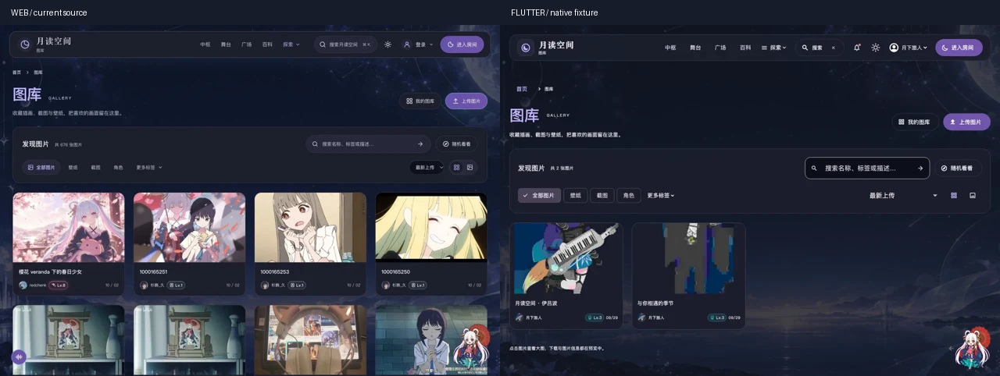
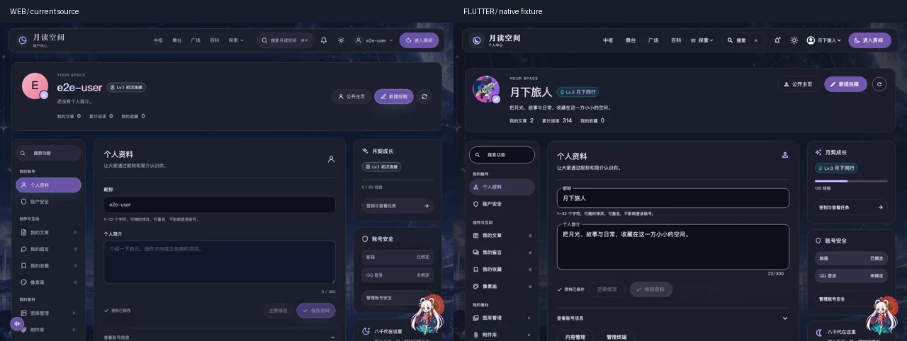
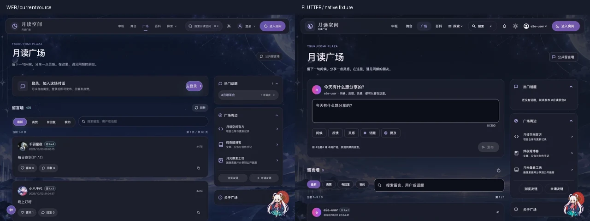
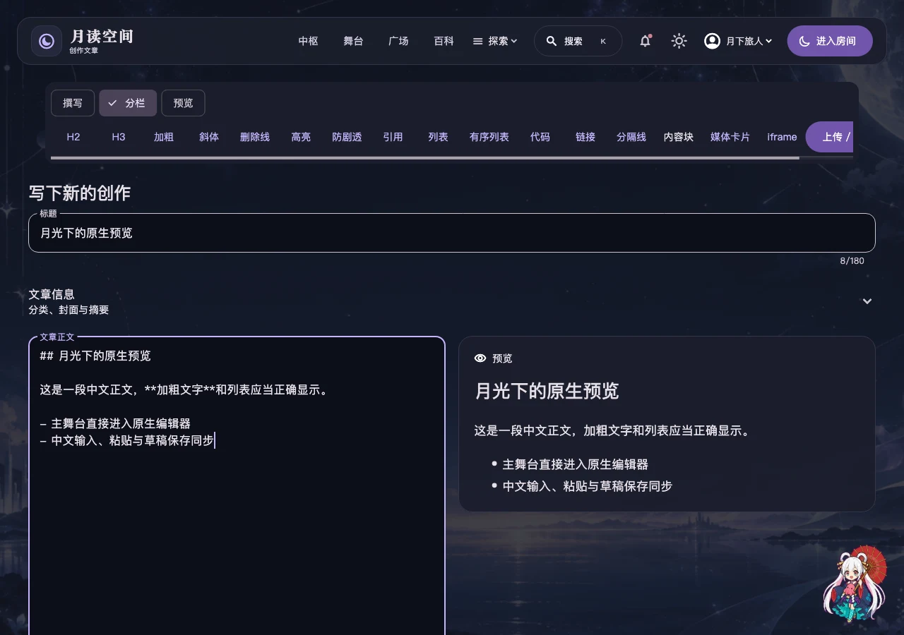
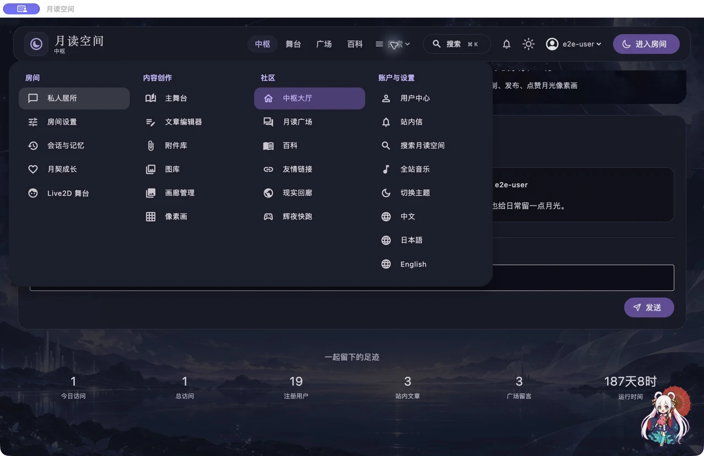

# 0.6.5：当前网站 UI 同步与中枢滚动修复

日期：2026-10-03。版本：`0.6.5+11 / v0.6.5-beta.1`。

本轮同步图库、个人中心、主舞台与广场的最新结构和交互，修复 Room 后台通知导致中枢重复构建、像素预览重复绘制及过大的图片解码。继续默认进入 Room，文章编辑和预览保持原生，后台权限继续由服务端确认。

## 参照与截图

- 当前原站源码：[6487ceb](https://github.com/redchenk/tsukuyomi-space/tree/6487ceb5c0c7729f522c546467a84d5734bd70b6)。对比上一轮参照 `5c4346e`，核对 Vue 页面、路由、三语文案、CSS 与接口；归档来源及发布回归后端均更新到同一提交。
- 浏览器读取生产站图库和广场；个人中心使用同一源码构建的隔离站及一次性普通用户。未登录生产账户、发布文章或修改生产数据。
- 原生图片来自本轮 Flutter 页面捕获及真实 macOS QA 窗口。严格截图接口遇到未知路径即失败，图库另检查每张缩略图已经解码，避免头像加载成功掩盖缩略图失败。
- [截图来源、尺寸和 SHA-256](qa/ui-v0.6.5/capture-manifest.json)。WebP 保留完整画面，只缩放/编码；并排图左网页、右 Flutter。生产数据与测试数据不同，不能据此声称逐像素一致。





## 更新核对表

| 页面 | 操作与结果 | 权限 / 接口 | 验证 |
| --- | --- | --- | --- |
| 图库 | 紧凑标题与发现栏；全部/壁纸/截图/角色、标签、搜索、最新/最早、四/三列、手动随机；16:10 图片卡片 | 公开浏览；`/api/assets/gallery/public`、`/api/assets/gallery`，上传与管理沿用账户/管理员规则 | 筛选参数、列数、空状态、原生上传入口、三语和大字号 |
| 图片预览 | 前后图片循环、左右键、Esc、关闭后焦点恢复；信息、标签、原图及下载 | 同源才携带 Cookie；跨域重定向移除 Cookie；100MB 下载上限；账号/站点变更关闭预览并使操作失效 | 键盘、头像权限、下载、重定向、账号切换、解码失败只回退一次 |
| 图库上传/管理 | 原生文件选择、分片、恢复上传、公开图库说明、删除确认 | `/api/assets`、`/api/assets/uploads`；已有服务端审核/管理权限 | 保留真实上传流程，未用占位接口替换 |
| 个人中心 | 紧凑身份与三项统计；宽屏左分组搜索、中工作区、右成长/安全/Room，窄屏下拉及素材入口 | `/api/user/profile`、`/api/growth/me`；账号私有数据 | 原生头像/昵称、全部分区、360px 英语两倍字号 |
| 资料与创作管理 | 修改提示、恢复、可收起账号信息；未保存时禁止刷新；头像/安全操作保留未保存资料；文章返回/恢复前台后刷新 | `/api/user/articles/live/<timestamp>`、`/api/messages/mine`、`/api/user/bookmarks`、`/api/pixel-art/manage` | 节流与并发去重、错误保留现有列表、旧账号响应/删除确认失效 |
| 主舞台 / 文章返回 | 默认最新，支持精选/每日；读取排序、分类、搜索和页码；文章返回保留筛选；新建投稿进入原生编辑器 | `/api/articles`、`/api/article-categories`；投稿需登录 | 裸舞台重置旧状态；外站 `from` 被拒绝；保留合法站内查询 |
| 广场发布 | 紧凑头部、登录发布栏/访客入口、心情、话题、提及、300 字、Ctrl/Cmd+Enter | `/api/messages`；沿用登录与发言限制；中文组合输入时不提交 | 空白禁用、发布中禁用、快捷键读取最新输入、选区插入、焦点恢复 |
| 广场留言 | 搜索含回复/作者；全部/回复/点赞/我的，访客点“我的”进入原生登录；作者/等级/上海日期、楼层编号和复制；回复最新在前，默认一条/三行，展开单条或全部 | `/api/messages/liked`、`/api/messages/topics`、`/api/stats`、点赞/回复接口 | SQLite UTC 与显式时区排序、原文复制、锚点分页、话题/提及点击 |
| 广场侧栏 | 热门话题、周边入口和关于；窄屏折叠块放在留言墙之前 | 相同话题/统计数据，友链等进入原生路由 | 宽窄布局、三语、键盘与标签链接 |
| 访问统计 | 只提交路由路径，忽略查询/锚点；授权回调不提交访问统计 | `/api/stats/view` | 回调参数不进入统计记录，去重规则保留 |
| 中枢 | 场景卡片、聚合预览、像素作品、问候与统计保持；账号/站点改变重新加载 | `/api/hub-preview`、`/api/settings`、`/api/messages` | 同账号 30 次 Room 通知不替换中枢内容、不增加请求；切换账号刷新 |

### 明确保留的原生差异

- 字体、系统图标、Material 控件、菜单/文件选择器与网页 CSS 不会逐像素相同。上传使用原生选择器，移动端下载提供系统保存/分享；图片尺寸信息依赖 API 是否提供对应元数据。
- 广场窄屏三个折叠块纵排，网页使用紧凑横向按钮；功能与位置一致。发布栏当前账户没有头像字段时显示占位头像，留言作者的 API 头像正常显示。话题筛选在当前页面更新，初始深链接查询仍支持。
- 个人中心和广场侧栏随正文滚动；顶部导航固定。账号权限、保存及请求隔离使用原生控制器。
- 编辑器保持用户指定的紧凑头部、可收起文章信息、固定工具栏及撰写/分栏/预览模式。Room 就地配置、桌面 Agent、原生 Live2D 保持原生计划。网站 Fushi/AstrBot 授权联接仍是网站专属页面，本轮未迁移到原生。





## 中枢性能

原来的中枢监听整个 Room 控制器，每次聊天/工作区通知都触发整页构建；像素缩略图在每次绘制时重新解码、逐像素绘制，绘制器始终要求重画；背景和场景卡片解码未按显示尺寸限制。

现改为只在账户/站点范围变化时重新加载内容，顶栏独立观察账户；主图、场景和预览分离重绘。像素缩略图仅在渲染数据变化时上传一张 RGBA 图片，最近邻绘制，透明像素和调色板保留，并释放旧/过期图片。背景与卡片按显示尺寸及 DPR 限制解码。

测量设备：Apple M5，macOS 27.0.1，Flutter 3.47.5，macOS **profile**，1280×797 逻辑尺寸、DPR=2。相同背景、三张场景卡片、96×54 密集像素画和三条问候；预热后执行 12 次交替指针 fling，500px、2200px/s。修复前后的同场景各重复三次。

| 次数 | UI P95 前 → 后 (ms) | Raster P95 前 → 后 (ms) | 超过 16.7ms 帧，前 / 后 |
| --- | --- | --- | --- |
| 1 | 2.352 → 0.941 | 4.366 → 3.842 | 0 / 0 |
| 2 | 2.169 → 0.944 | 4.266 → 3.535 | 0 / 0 |
| 3 | 2.366 → 0.952 | 4.443 → 3.578 | 0 / 0 |
| 中位数 | **2.352 → 0.944（约下降 60%）** | **4.366 → 3.578（约下降 18%）** | 0 / 0 |

三次解码图片缓存均为 **46,118,948 → 15,616,752 bytes**（约下降 66%）。这是 Flutter 图片缓存，不是应用总内存；RSS 原始记录一并提供，不据短时样本声称已证明长期内存稳定。

另在同样滚动期间，每 32ms 发一次 Room 工作区通知：

| 次数 | UI P95 前 → 后 (ms) | Raster P95 前 → 后 (ms) | 像素预览 Widget 替换，前 → 后 |
| --- | --- | --- | --- |
| 1 | 3.261 → 1.791 | 4.420 → 4.108 | 281 → 0 |
| 2 | 3.305 → 1.672 | 4.244 → 4.037 | 281 → 0 |
| 3 | 3.296 → 1.750 | 4.332 → 4.100 | 279 → 0 |

修复后每次收到 472 个工作区通知，预览 Widget 无替换。记录包含滚动起止、距离和每次手势耗时；修复前后采样时长不同，不把时长变化单独解释为惯性问题已经被直接证明。

冷启动首屏另行记录：UI P95 三次前为 12.009/4.592/3.228ms，后为 11.407/5.245/5.878ms；Raster 前为 13.146/2.295/2.278ms，后为 16.233/0.939/1.658ms。冷数据有明显波动，不能用预热滚动改善推导所有启动场景均已达到预算。此基准不包含同时运行 Live2D，也不是所有手机 GPU 的验收。

原始报告：[普通滚动前](qa/ui-v0.6.5/performance/hub-fling-before.json)、[后](qa/ui-v0.6.5/performance/hub-fling-after.json)；[通知压力前](qa/ui-v0.6.5/performance/hub-trajectory-before.json)、[后](qa/ui-v0.6.5/performance/hub-trajectory-after.json)。修复前使用基线 `54efac3` 的 Hub/像素预览实现，其余场景及基准保持一致。

复现（需 macOS Flutter SDK 及项目构建依赖；普通模式去掉 `BENCHMARK_BUSY`）：

```sh
flutter drive --profile -d macos \
  --driver=test_driver/hub_performance_driver.dart \
  --target=integration_test/hub_scroll_performance_test.dart \
  --dart-define=BENCHMARK_BUSY=true \
  --dart-define=BENCHMARK_LABEL=trajectory-after
```

## 验证与交付边界

- 本地完整回归 **587 项通过、无跳过**，包括真实隔离原站后端、Cubism、固定 OpenCode/Codex 运行时、四模型协议、权限/账号/站点隔离、草稿/中文输入、取消、原生内容与菜单。静态分析无问题；发布工具 37 项、Agent 打包工具 3 项通过。
- 整站 **28×5×3×2=840 布局场景**：360/390/768/1280/1920 宽度，中文/日语/英语、深浅色；英语使用两倍字号，滚动后再次检查。矩阵包含在 587 项中，不另加为测试数。28 路由及核对范围见 [上一版完整路由表](native-ui-parity-v0.6.4.md#逐页核对表)，本轮全部重新运行。
- 最终视觉检查另补上图库缩略图按卡片宽度的解码缓存，并强化逐图断言；该截图用例追加重跑通过。主舞台/广场交互最终 10 项再次通过，包含访客“我的”登录行为。实际 macOS 窗口确认中枢滚动、四组菜单、个人中心→我的文章→原生编辑器；中文正文/分栏和手机预览由真实 Flutter 输入与渲染测试捕获。
- 发布流水线要求五平台构建、Android 原生启动 smoke、三桌面捆绑 Agent 运行时验证，全部成功才创建预发布。发布页提供八个安装包、安装说明、运行时许可证及 SHA-256。
- macOS/Windows 暂无发行商签名，iOS 为需自行签名的 unsigned IPA。Windows 严格沙箱依赖系统 PSEC，缺少时拒绝命令；未验证支持 PSEC 的 Windows 实机。
- 未使用用户 DeepSeek 密钥、生产账号或付费模型。本轮数据证明当前 macOS 中枢受控场景的改进；五平台 CI、widget 测试不能替代对应真机的输入法、签名、GPU、长期内存与真实模型服务验收。
